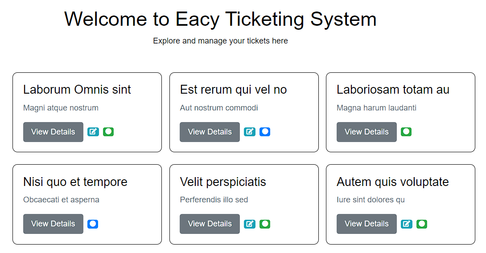
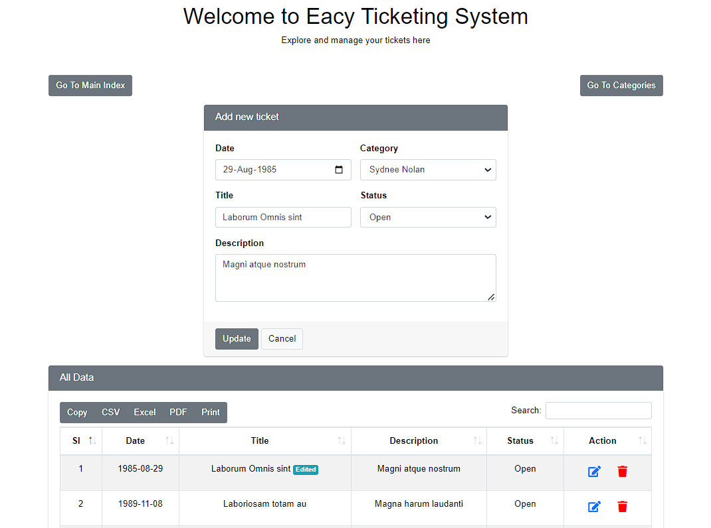
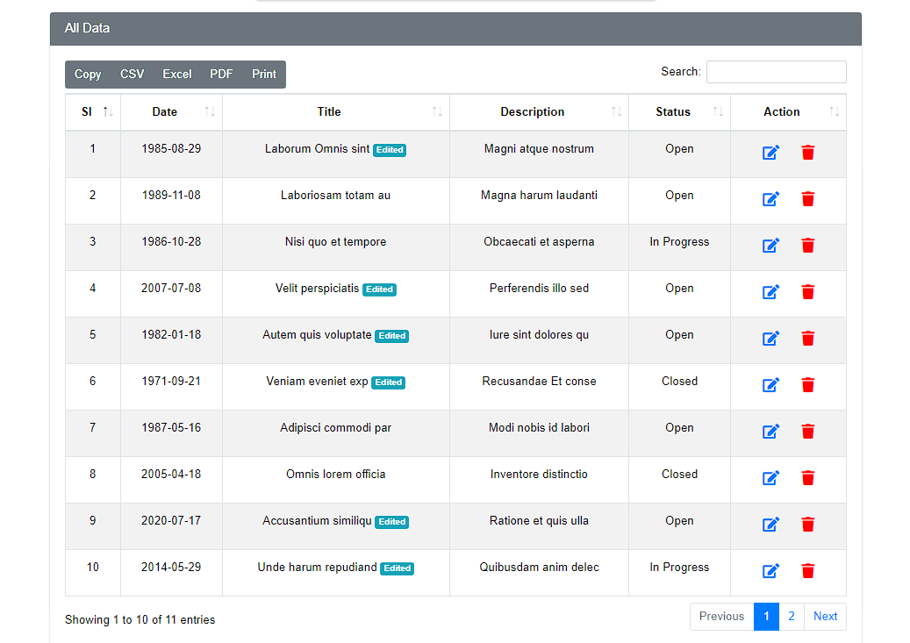

# Ticketing System

## Description

A Laravel web app for ticket managing

### Features:

-   Category and Ticket Management with AJAX

## Technologies:

-   Laravel, HTML/CSS, JavaScript/jQuery, MySQL, Bootstrap

## Setup:

1. Clone the repository
2. Copy .env.example and rename it to .env then `php artisan key:generate` 
3. Run `composer install`
3. Set up the database
4. Run migrations with `php artisan migrate`
4. Serve the application with `php artisan serve`

## Contributor:

-   **[Sakib](https://github.com/saakiiib/)**

## Screenshots

